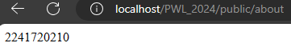
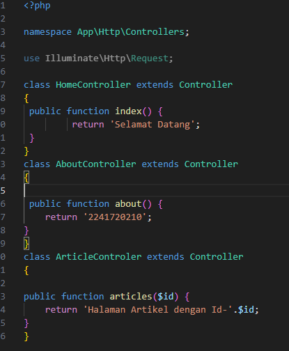

# **Laporan WPL_2024**
## **1. Basic Routing**

a.  route ’/’  

b.  route ’/about’  

## **2. Route Parameters**

a.  route /user/{name} 

b.  route /user/ tidak akan menampilkan apa-apa  

c. route /posts/{post}/comments/{comment} akan menampilkan 2 parameter yaitu yang pertama parameter "pos ke-1" dan parameter kedua "komentar ke-5"
 

d. route /articles/{id} 
 

## **3. Optional Parameters**

a.  Karena function ($name=null) jadi jika kita tidak mengisi parameternya program tetap akan berjalan dengan parameter null/kosong 

b.  Langsung menampilkan nama "john" karna kita memasukan namanya di parameter jadi kita ditakperlu mengetik parameternya lagi  

## **4. Controller**

a.  di route ini kita memanggil controller "WelcomeController" dalam controller itu memanggil fungsi hallo() yang mereturn kalimat "hallo world dunia"

b.  Modifikasi dalam 1 controller 

c.  Modifikasi dalam  Single Action Controller 

## **5. View**

a.  Membuat sebuah pemanggilan fungsi view() berisi nama saya

## **6. View dalam direktori**

a. Jika file view berada di dalam direktori lain, maka kita bisa menggunakan “dot” notation untuk mereferensikan direktori tersebut

## **7. Menampilkan view dari controller**

a. Menampilkan view dari controller, maka router nya diganti langsung memanggil controller yang terdapat view didalamnya

## **8. Meneruskan data ke view**
a. Untuk meneruskan array data lengkap ke fungsi view, menggunakan metode "with" untuk menambahkan bagian data individual ke view. Metode with mengembalikan instance view objek sehingga kita dapat melanjutkan rangkaian metode sebelum mengembalikan tampilan 

----------------------------
Terima Kasih

Muhammad Dayutirta Mahara | TI-2F | 2241720210 | Politeknik Negeri Malang

_______________
